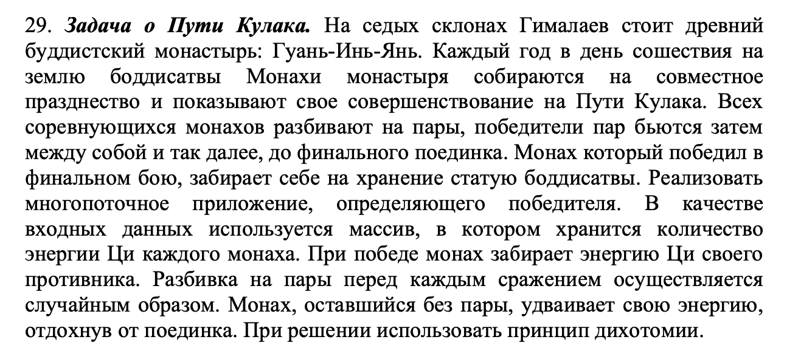

Условие задания:  
  

Запуск:  
1) В командную строку можно передать единственный аргумент - количество монахов для генерации.  
2) Если аргумент не передан, количество монахов будет вводиться с консоли. 
3) При числе аргументов больше 1 или неверном формате аргумента будет сгенерирован турнир с 10 монахами. 
 

Многопоточность и дихотомия:  
В своей программе я использую рекурсивный параллелизм. Каждый раз разбивая массив на две части, я поручаю поиск победителя в двух его частях разным потокам(и они независимо их находят). Также перед разбиением я случайным образом перемешиваю массив(используя вихрь Мерсенна), что гарантирует случайность подбора пар.
В итоге получается дерево турнира. Когда разбиение доходит до того, что в массиве остается два участника или один, происходит подъем. Данный метод использует принцип Дихотомии, порождая из одного процесса - два. 
 
В своей программе я использую std::async с флагом launch::async(который гарантирует запуск потоков), потому что это удобная замена прямого использования std::thread в случаях когда создается отдельный поток на каждую задачу.